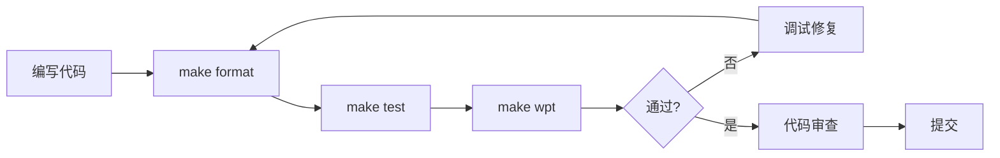

# jsrt Claude Agents 快速参考

## 🎯 核心 Agents (6个优化版)

| Agent | 用途 | 关键命令 | 职责范围 |
|-------|------|----------|----------|
| 🔵 **jsrt-developer** | 综合开发 | `make format && make test && make wpt` | 模块开发、QuickJS集成、构建优化、示例创建 |
| 🟢 **jsrt-tester** | 测试调试 | `make test`, `make wpt`, `make jsrt_m` | 单元测试、WPT测试、内存调试、ASAN分析 |
| 🟡 **jsrt-compliance** | 标准合规 | `make wpt N=category` | WPT合规、WinterCG标准、Web API兼容性 |
| 🔴 **jsrt-code-reviewer** | 代码审查 | `git diff`, `make format` | 质量检查、安全审查、内存管理、标准遵循 |
| 🟣 **jsrt-cross-platform** | 跨平台 | 平台适配 | Windows/Linux/macOS兼容性 |
| 🔷 **jsrt-formatter** | 格式化 | `make format` | C和JS代码格式化、风格统一 |

## ⚡ 快速使用

### 开发工作流
```bash
# 完整开发流程
make format         # 格式化 C 和 JS 代码
make test          # 运行单元测试
make wpt           # 运行 Web Platform Tests
```

### WPT 调试流程
```bash
# 当 make wpt 失败时
mkdir -p target/tmp
SHOW_ALL_FAILURES=1 make wpt N=url > target/tmp/wpt-debug.log 2>&1
less target/tmp/wpt-debug.log    # 查看详细失败信息
make wpt N=url                   # 修复后重新测试
make wpt                         # 完整验证
```

### 内存调试
```bash
# 构建 ASAN 版本
make jsrt_m

# 检测内存泄漏
ASAN_OPTIONS=detect_leaks=1 ./target/debug/jsrt_m target/tmp/test.js
```

## 📁 文件组织规则

| 文件类型 | 存放位置 | 说明 |
|----------|----------|------|
| **永久测试** | `test/` | 提交到仓库的测试用例 |
| **临时测试** | `target/tmp/` | 调试用临时文件，git忽略 |
| **示例代码** | `examples/` | 功能演示示例 |
| **源代码** | `src/` | 核心实现 |
| **标准库模块** | `src/std/` | jsrt标准库模块 |

## 🔧 关键命令

### 构建命令
```bash
make            # 发布版本构建
make jsrt_g     # 调试版本（带符号）
make jsrt_m     # ASAN版本（内存检测）
make format     # 格式化所有代码
```

### 测试命令
```bash
make test       # 单元测试（必须通过）
make wpt        # WPT测试（必须通过）
make wpt N=url  # 测试特定分类
```

### 调试命令
```bash
# WPT分类调试
SHOW_ALL_FAILURES=1 make wpt N=console > target/tmp/debug.log 2>&1

# 常见WPT分类
- console: 控制台API
- url: URL和URLSearchParams
- encoding: TextEncoder/TextDecoder
- streams: 流API
- crypto: WebCrypto子集
```

## 🚀 最佳实践与使用示例

### 1. 实现新的 API
**场景**：需要添加 `crypto.subtle.digest()` 方法

```bash
# 使用 jsrt-developer agent
"帮我实现 crypto.subtle.digest() API"

# Agent 工作流程：
1. 创建 src/std/crypto_subtle.c
2. 实现 digest 方法符合 WebCrypto 规范
3. 注册到 src/runtime.c
4. 创建 test/test_crypto_digest.js
5. 运行 make format && make test && make wpt
```

### 2. 修复 API Bug
**场景**：`URL.parse()` 解析相对路径错误

```bash
# 使用 jsrt-tester + jsrt-developer
"URL.parse() 在解析相对路径时失败，帮我调试并修复"

# Agent 工作流程：
1. 创建 target/tmp/url-bug.js 重现问题
2. 使用 ./target/debug/jsrt_g 调试
3. 定位 src/std/url.c 中的问题
4. 修复解析逻辑
5. 运行 make wpt N=url 验证修复
6. 运行完整测试 make test && make wpt
```

### 3. 实现 WinterCG API
**场景**：添加 `queueMicrotask()` 全局函数

```bash
# 使用 jsrt-compliance + jsrt-developer
"实现 WinterCG 要求的 queueMicrotask() 全局函数"

# Agent 工作流程：
1. 查阅 WinterCG 规范确认签名
2. 在 src/runtime.c 添加全局函数
3. 实现微任务队列机制
4. 创建 test/test_queue_microtask.js
5. 确保与其他运行时行为一致
6. 运行 make test && make wpt
```

### 4. 修复 WPT 测试失败
**场景**：`console` 分类的 WPT 测试有失败

```bash
# 使用 jsrt-tester + jsrt-compliance
"WPT console 测试失败，帮我调试并修复"

# Agent 工作流程：
1. mkdir -p target/tmp
2. SHOW_ALL_FAILURES=1 make wpt N=console > target/tmp/wpt-console.log 2>&1
3. less target/tmp/wpt-console.log 分析失败原因
4. 修复 src/std/console.c 中的实现
5. make wpt N=console 验证单项通过
6. make wpt 确保无回归
```

### 5. 增强 Node.js 模块兼容性
**场景**：支持 Node.js 的 `process.nextTick()`

```bash
# 使用 jsrt-developer + jsrt-cross-platform
"添加 process.nextTick() 以提高 Node.js 兼容性"

# Agent 工作流程：
1. 研究 Node.js 的 nextTick 行为
2. 在 src/std/process.c 添加实现
3. 确保与 queueMicrotask 的优先级差异
4. 创建兼容性测试 test/test_node_compat.js
5. 测试跨平台行为一致性
6. 运行 make format && make test
```

### 6. 优化和更新文档
**场景**：更新 API 文档和示例

```bash
# 使用 jsrt-developer（处理示例）
"更新 URL API 的文档和示例"

# Agent 工作流程：
1. 创建 examples/url/basic_usage.js
2. 创建 examples/url/advanced_parsing.js
3. 添加错误处理示例
4. 确保示例可运行: ./target/release/jsrt examples/url/*.js
5. 更新 CLAUDE.md 中的相关说明
6. 运行 make format 格式化示例代码
```

## 🎯 Agent 选择指南

| 任务类型 | 推荐 Agent 组合 | 原因 |
|----------|----------------|------|
| **新功能开发** | jsrt-developer | 包含完整开发流程 |
| **Bug 修复** | jsrt-tester → jsrt-developer | 先定位后修复 |
| **标准合规** | jsrt-compliance → jsrt-developer | 先确认规范后实现 |
| **内存问题** | jsrt-tester | 专门的 ASAN 调试能力 |
| **跨平台问题** | jsrt-cross-platform → jsrt-developer | 平台适配后实现 |
| **代码质量** | jsrt-code-reviewer | 全面的质量检查 |
| **WPT 失败** | jsrt-tester → jsrt-compliance | 调试后确保合规 |

## ✅ 核心原则

1. **格式化**：提交前必须运行 `make format`
2. **测试**：`make test` 和 `make wpt` 都必须通过
3. **文件位置**：临时文件只能在 `target/tmp/`
4. **内存管理**：所有分配必须有对应释放
5. **跨平台**：Windows函数需要 `jsrt_` 前缀包装
6. **标准合规**：不能添加非标准扩展到Web API

## 🔄 工作流程



## 📁 项目结构

```
.claude/
├── agents/              # Agent定义（6个.md文件）
│   ├── jsrt-developer.md
│   ├── jsrt-tester.md
│   ├── jsrt-compliance.md
│   ├── jsrt-code-reviewer.md
│   ├── jsrt-cross-platform.md
│   └── jsrt-formatter.md
├── settings.json        # Claude Code项目设置
└── AGENTS_SUMMARY.md    # 本文档
```

---
💡 **提示**：使用具体的agent处理特定任务，如"使用jsrt-tester调试内存问题"或"使用jsrt-compliance检查WPT合规性"。