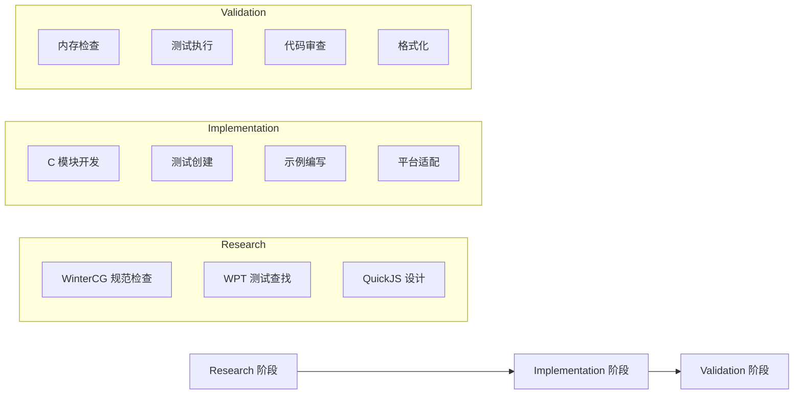

# 并行 Agents 使用指南

本指南介绍如何配置和使用 jsrt 项目的并行 agents 来加速开发流程。

## 快速开始

### 启用并行执行

最简单的并行执行方式是直接请求多个任务：

```
"同时进行代码格式化、测试运行和内存检查"
```

Claude Code 会自动识别这些任务可以并行执行，并分派相应的 agents。

### 使用预定义工作流

```
"使用 full-feature-development 工作流来实现新的 fs 模块"
"运行 pre-commit-check 工作流检查我的更改"
"执行 quick-debug 工作流来诊断这个崩溃"
```

## 预定义并行工作流

### 1. 🚀 full-feature-development
**用途**：完整的功能开发流程

**执行阶段**：


**使用示例**：
```bash
# 请求示例
"为 jsrt 实现新的 crypto 模块，使用完整开发工作流"

# 系统将并行执行：
Phase 1: 研究阶段（3个 agents 并行）
Phase 2: 实现阶段（4个 agents 并行）  
Phase 3: 验证阶段（4个 agents 并行）
```

---

### 2. 🐛 quick-debug
**用途**：快速并行诊断问题

**并行任务**：
- 🔴 内存分析（jsrt-memory-debugger）
- 🟢 测试隔离（jsrt-test-runner）
- 🟣 平台检查（jsrt-cross-platform）
- 🟪 JS/C 边界分析（jsrt-quickjs-expert）

**使用示例**：
```bash
"使用 quick-debug 诊断 timer 模块的段错误"
```

---

### 3. ✅ pre-commit-check
**用途**：提交前的质量检查

**并行任务**（5分钟超时）：
- 🔷 代码格式化（必需）
- 🟢 测试运行（必需）
- 🔴 内存检查（可选）
- 🟡 代码审查（必需）

**使用示例**：
```bash
"运行提交前检查"
```

---

### 4. ⚡ performance-optimization
**用途**：性能分析和优化

**两阶段并行**：
1. **Profiling 阶段**：构建分析、执行热点、内存模式
2. **Optimization 阶段**：应用优化、代码路径优化、绑定优化

---

### 5. 📋 compliance-audit
**用途**：标准合规性检查

**并行审计**：
- WPT 测试套件运行
- WinterCG API 合规检查
- API 签名审查

---

### 6. 📦 release-preparation
**用途**：发布准备

**三阶段并行**：
1. **Testing**：全平台测试、内存扫描、WPT 验证
2. **Quality**：代码格式、安全审计、构建优化
3. **Documentation**：更新示例、API 文档

## 自定义并行任务

### 基本语法

```javascript
// 方式 1：简单并行请求
"并行执行：
 - 格式化所有代码
 - 运行测试套件
 - 检查内存泄漏"

// 方式 2：指定 agents
"使用以下 agents 并行工作：
 - jsrt-module-developer 实现功能
 - jsrt-test-runner 创建测试
 - jsrt-example-creator 编写文档"

// 方式 3：分阶段并行
"分阶段执行：
 阶段1（并行）：分析需求、检查标准
 阶段2（并行）：开发模块、编写测试
 阶段3（并行）：运行验证、代码审查"
```

### 高级配置

```yaml
custom_workflow:
  name: "my-custom-workflow"
  phases:
    - name: "analysis"
      parallel: true
      timeout: 600
      agents:
        - jsrt-code-reviewer
        - jsrt-memory-debugger
    - name: "fix"
      parallel: false  # 顺序执行
      agents:
        - jsrt-module-developer
    - name: "verify"
      parallel: true
      agents:
        - jsrt-test-runner
        - jsrt-cross-platform
```

## 并行执行规则

### 资源限制

| 限制类型 | 最大并行数 | 说明 |
|---------|-----------|------|
| 总并行 agents | 5 | 同时运行的最大 agents 数 |
| 内存密集型 | 2 | ASAN、WPT 测试等 |
| CPU 密集型 | 3 | 构建、编译等 |
| I/O 密集型 | 3 | 文件操作、格式化等 |

### 冲突处理

1. **文件冲突**：如果多个 agents 需要修改同一文件，自动转为顺序执行
2. **资源冲突**：基于优先级调度（高优先级先执行）
3. **依赖冲突**：等待依赖完成后执行

### 失败处理

- **默认行为**：一个任务失败，停止整个工作流
- **重试机制**：自动重试失败任务（最多2次）
- **回滚支持**：保存执行前状态，失败时可回滚

## 监控并行执行

### 实时状态

执行时会显示实时状态：

```
[Parallel Execution Status - 14:23:45]
━━━━━━━━━━━━━━━━━━━━━━━━━━━━━━━━━━━
Phase: Implementation (2/3)

Running (3):
  ✓ jsrt-module-developer    [████████░░] 80% - Implementing timer.c
  ✓ jsrt-test-runner         [██████░░░░] 60% - Creating test cases
  ✓ jsrt-example-creator     [█████████░] 90% - Writing examples

Completed:
  ✓ jsrt-wintercg-compliance - Spec check complete
  ✓ jsrt-wpt-compliance      - Found 15 relevant tests
  ✓ jsrt-quickjs-expert      - Design approved

Pending:
  ○ jsrt-memory-debugger     - Waiting for phase 3
  ○ jsrt-code-reviewer       - Waiting for phase 3
━━━━━━━━━━━━━━━━━━━━━━━━━━━━━━━━━━━
```

### 执行报告

完成后生成汇总报告：

```markdown
## Parallel Execution Report

**Workflow**: full-feature-development
**Total Time**: 8m 34s (串行预估: 25m)
**Speedup**: 2.9x

### Phase Results
- ✅ Research: 2m 15s (3 agents)
- ✅ Implementation: 4m 30s (4 agents)  
- ✅ Validation: 1m 49s (4 agents)

### Issues Found
- Memory leak in timer_callback (fixed)
- Missing Windows compatibility (added)
- 2 test failures (resolved)

### Next Steps
1. Review generated documentation
2. Run integration tests
3. Update CHANGELOG.md
```

## 最佳实践

### 1. 选择合适的并行粒度

❌ **过细粒度**：
```
"并行检查每个单独的源文件"  // 开销大于收益
```

✅ **合适粒度**：
```
"并行进行模块开发、测试创建和文档编写"
```

### 2. 识别可并行任务

**可并行**：
- 不同模块的开发
- 独立的测试创建
- 文档和示例编写
- 不同平台的测试

**需顺序**：
- 代码格式化（可能产生冲突）
- 构建系统修改
- 全局配置更改

### 3. 处理依赖关系

```javascript
// 明确指定依赖
"执行工作流：
 1. 先并行：研究规范、分析现有代码
 2. 基于研究结果，并行：实现、测试、文档
 3. 最后并行验证所有更改"
```

### 4. 优化资源使用

```yaml
# 错开资源密集型任务
phase1:
  - jsrt-memory-debugger  # 内存密集
  - jsrt-example-creator  # 轻量级
  
phase2:  
  - jsrt-build-optimizer  # CPU密集
  - jsrt-formatter        # I/O密集
```

## 故障排除

### 常见问题

**Q: 并行执行似乎没有加速？**
- 检查任务是否真正独立
- 确认没有资源瓶颈
- 查看是否有隐式依赖

**Q: 某个 agent 总是失败？**
- 查看该 agent 的日志
- 尝试单独运行该任务
- 检查是否有环境问题

**Q: 文件冲突如何处理？**
- 系统会自动检测并串行化冲突操作
- 可以手动指定执行顺序

**Q: 如何调试并行执行？**
```bash
# 启用详细日志
"使用 debug 模式运行 pre-commit-check 工作流"

# 单步执行
"逐阶段运行 full-feature-development 工作流"
```

## 性能基准

| 任务类型 | 串行时间 | 并行时间 | 加速比 |
|---------|---------|---------|--------|
| 完整功能开发 | ~25分钟 | ~9分钟 | 2.8x |
| 提交前检查 | ~10分钟 | ~3分钟 | 3.3x |
| 调试诊断 | ~15分钟 | ~5分钟 | 3.0x |
| 发布准备 | ~45分钟 | ~15分钟 | 3.0x |

## 配置文件位置

```
.claude/
├── agents/                      # Agent 定义
│   ├── jsrt-parallel-coordinator.md  # 并行协调器
│   └── ...
├── workflows/                   # 工作流定义
│   └── parallel-workflows.json  # 并行工作流配置
└── ...
```

## 扩展和自定义

要创建自己的并行工作流：

1. 编辑 `.claude/workflows/parallel-workflows.json`
2. 添加新的工作流定义
3. 指定阶段和并行任务
4. 测试工作流：`"运行自定义工作流 my-workflow"`

## 总结

并行 agents 能够显著提升开发效率：

- **2-3倍速度提升**：通过并行执行独立任务
- **自动冲突处理**：智能处理资源和文件冲突
- **灵活配置**：支持预定义和自定义工作流
- **实时监控**：清晰的执行状态和进度报告

开始使用并行 agents，让你的 jsrt 开发更高效！